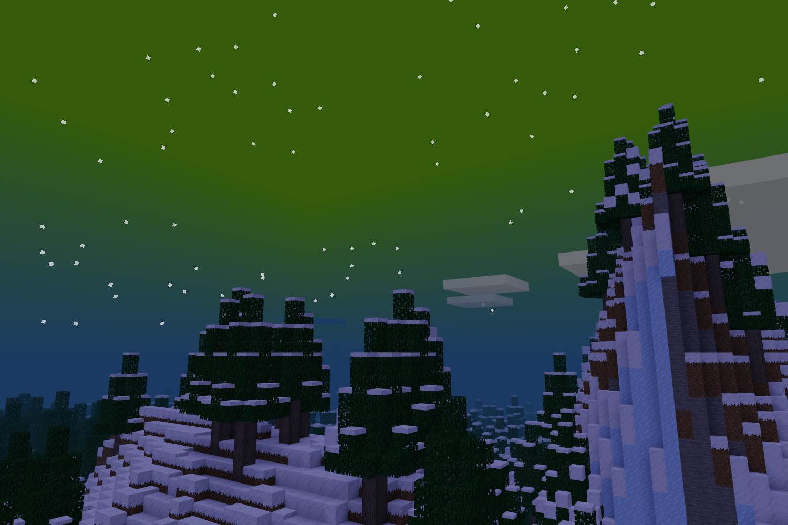

# Auroras

[Minetest Forum topic](https://forum.minetest.net/viewtopic.php?f=11&t=25248)

Auroras mod for Minetest. Adds northern/southern lights at night.
Since the Minetest world doesn't exactly have polar regions, auroras will appear in any sufficiently cold place.
Be patient—auroras aren't always visible!

### Features:

- Different auroras every night, with semi-realistic colors.
- Players near each other see similar colors.
- Configurable, no media/assets.

This mod works with Minetest 5.2.0 or later, and is compatible with TestificateMods' Climate API/Regional Weather mods.
It probably won't work with other mods/games that regularly change the skybox.
